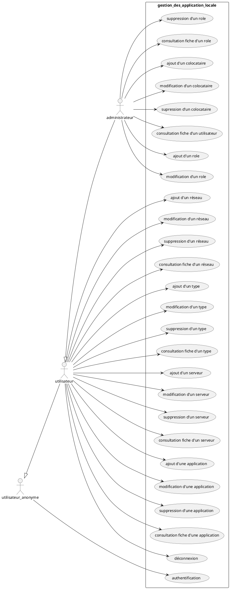

durant ce stage 
j'ai dut créer un application web en php et sql

1. contexte

Actuellement, toutes les informations concernant les applications locales sont stockées dans des fichiers accessibles (excel, powerpoint, etc.) sur le répertoire partagé de la DSI1.

Ces informations sont difficiles à maintenir à jour car il ne faut oublier aucun fichier.

2. objectif

L’objectif est de créer une nouvelle application permettant de centraliser l’ensemble des informations concernant les applications locales.

Dans un premier temps, il s’agira de récupérer les données issues du fichier Excel applications_locales.xlsx et de proposer une interface web permettant la gestion de ses données.

le cahier des charge se situe dans avant projet,
le model de la base de donnée et les action possible au final dans analye et conception,
la base de donnée dans réalisation,
les test des fontcion dans qualification et recette,
et le code dans gestion application du siec

cas d'utilisation
